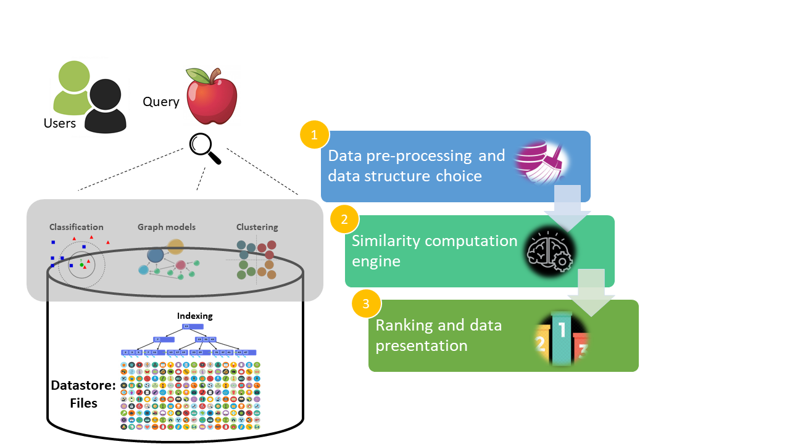

# Phase 3 Text and Image features, Graph models, Clustering, Indexing and Classification

**Abstract**

One of the classic problems in the web domain is to yield the best results as part of a user query that can be in form of multimedia. There are various techniques one can employ
for Information Retrieval (IR) from huge sets of multimedia consisting of text, images, audio, video, etc. In this phase, we focus on implementing a search engine by applying the
concepts of graphs models, state of the art techniques of clustering, partitioning, indexing and classification - Angular clustering, Single pass iterative clustering, Pagerank,
Personalized pagerank, Locality Sensitive Hashing, KNN and Personalized pagerank based classification, and similarity/distance measures for textual and visual descriptors of
multimedia on a publicly available dataset comprising of various models to represent text and images.

The search engines may yield varying results based on their model implementation. We strongly focus on the use of proven similarity metrics like Euclidean distance that work
well with images and choose the visual models to yield best results in the given time frame.

**Introduction**

In this phase, we experiment with the dataset provided with respect to three entities - location, user and images where each user has captured a set of images at certain
locations and has tagged them. It also provides two categories of information - some of the features are extracted for text (image tags, title) like TF, DF, TF-IDF scores
forming a set of textual descriptors and various models for images like CN, CM, HOG, etc which are extracted from the images and form a set of visual descriptors. These
descriptors help in creating a feature vector for each entity in the dataset and enable comparison between them by computing a similarity score using metrics like
Euclidean distance.

We primarily work on visual descriptors and graph models. Clustering/partitioning algorithms are explored. Top k ranking algorithms like pagerank and personalized pagerank
are also implemented. Search in multidimensional data space is supported well by an index structure, an example of which is Locality sensitive hashing (LSH). It is implemented
and query results are evaluated for an input consisting of a combination of visual descriptors given an image. We also evaluate KNN and Personalized pagerank based classification
algorithms for the set of images and labels provided.

